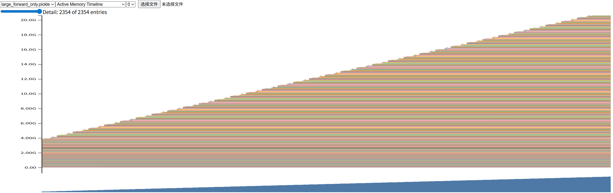
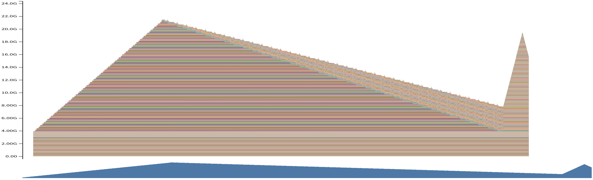

## answer to the questions in assignment

**My GPU is A100 40G*2**

### 1. Assignment Overview

#### Problem (benchmarking_script): 4 points
(b) Time the forward and backward passes for the model sizes described in §1.1.2. Use 5 warmup steps and compute the average and standard deviation of timings over 10 measurement steps. How long does a forward pass take? How about a backward pass? Do you see high variability across measurements, or is the standard deviation small?

**A100 cannot run the experiment... even with autocast!!!! So I have to skip `xl` and  `2.7B`** Basicly I run 5 steps warmup and 10 steps training.

| Model Size   |   Fwd Avg(ms) |   Fwd Std(ms) |   Fwd+Bwd Avg(ms) |   Fwd+Bwd Std(ms) |
|:-------------|--------------:|--------------:|------------------:|------------------:|
| small        |         46.51 |          0.18 |            140.2  |              0.29 |
| medium       |        141.24 |          0.03 |            431.83 |              0.36 |
| large        |        294.82 |          0.15 |            934.87 |              2.35 |

(c) One caveat of benchmarking is not performing the warm-up steps. Repeat your analysis without the warm-up steps. How does this affect your results? Why do you think this happens? Also try to run the script with 1 or 2 warm-up steps. Why might the result still be different?

*0 warmup*
| Model Size   |   Fwd Avg(ms) |   Fwd Std(ms) |   Fwd+Bwd Avg(ms) |   Fwd+Bwd Std(ms) |
|:-------------|--------------:|--------------:|------------------:|------------------:|
| small        |         84.29 |        106.03 |            152.14 |             34.64 |
| medium       |        147.16 |         17.33 |            433.08 |              3.74 |
| large        |        298.22 |         10.14 |            930.33 |              2.81 |

*1 warmup*
| Model Size   |   Fwd Avg(ms) |   Fwd Std(ms) |   Fwd+Bwd Avg(ms) |   Fwd+Bwd Std(ms) |
|:-------------|--------------:|--------------:|------------------:|------------------:|
| small        |         48    |          2.27 |            140.76 |              0.17 |
| medium       |        142.01 |          0.54 |            433.99 |              0.58 |
| large        |        296.78 |          0.97 |            936.59 |              1.07 |

*2 warmup*
| Model Size   |   Fwd Avg(ms) |   Fwd Std(ms) |   Fwd+Bwd Avg(ms) |   Fwd+Bwd Std(ms) |
|:-------------|--------------:|--------------:|------------------:|------------------:|
| small        |         48.91 |          3.77 |            141.31 |              0.21 |
| medium       |        141.85 |          0.36 |            434.72 |              0.79 |
| large        |        296.96 |          0.78 |            938.26 |              1.56 |

1. 不进行热身（0 warmup）如何影响结果？

* **平均耗时显著增加**：尤其对于 `small` 模型，正向传播的平均时间从有热身时的 **46.51ms** 飙升到了 **84.29ms**。
* **标准差（变异性）急剧增大**：这是最夸张的变化。`small` 模型的正向传播标准差从非常稳定的 **0.18ms** 激增到了 **106.03ms**！这说明测量结果极不稳定，第一次运行的耗时和后续运行的耗时相差巨大。

2. 为什么会发生这种情况？

    这背后的原因是 GPU 和相关软件库（如 PyTorch, CUDA）的 **“一次性启动开销” (one-time startup costs)**。当你第一次在代码中执行 GPU 操作时，会发生很多“幕后”准备工作，这些工作非常耗时，但只需要做一次。主要包括：

* **CUDA 上下文初始化 (Context Initialization)**：这是最主要的原因。GPU 驱动需要为你的程序初始化一个运行环境（上下文）。这个过程涉及到与硬件的通信和资源设置，耗时可能在几百毫秒，远超单次模型推理的时间。
* **内核加载与编译 (Kernel Loading/Compilation)**：PyTorch 的操作（如矩阵乘法）对应到 GPU 上一个个被称为“核函数”（Kernel）的小程序。第一次调用某个操作时，对应的核函数需要从硬盘加载到 GPU，有时甚至需要即时编译（JIT Compilation）来适配你的数据类型和尺寸。
* **内存分配器初始化 (Memory Allocator Initialization)**：PyTorch 有一个缓存内存分配器，用于高效地重用 GPU 显存，避免频繁地向系统申请和释放。这个分配器在第一次分配显存时也需要进行一些初始化设置。

    在“0 warmup”的测试中，这所有的一次性开销都被算进了你的**第一次测量**中，导致第一次测量的耗时极长。这就同时拉高了平均值，并造成了巨大的标准差。

3. 为什么 1 或 2 次热身后的结果可能仍然不同？

    你的实验数据也清晰地展示了，哪怕只有 **1 次**热身，情况就会好转非常多！`small` 模型的平均耗时降回了 **48ms**，标准差也骤降到了 **2.27ms**。这说明最主要的 CUDA 上下文初始化等开销已经被第一次热身运行“吸收”掉了。

    结果和 5 次热身相比，还是略有不同（比如标准差还是稍高一点），这可能是因为一些更细微的稳定过程：

* **缓存预热 (Cache Warming)**：GPU 内部也有 L1/L2 缓存。前一两次运行可能只是将数据和指令加载进缓存，系统还没达到最理想的状态。
* **动态算法选择 (Heuristics)**：某些底层库（如 cuDNN）在执行卷积或矩阵乘法时，内部有多种算法实现。它可能会在前几次运行时进行快速测试，然后“锁定”在最适合当前硬件和数据尺寸的最高效算法上。
* **系统抖动 (System Jitter)**：操作系统后台任务、GPU 的功耗/频率动态调整等因素都可能带来微小的性能波动。多运行几次热身有助于让系统进入一个更稳定的“巡航”状态。

    因此，进行 5-10 次热身是一个很好的实践，它能确保我们测量的不是系统“冷启动”的性能，而是它稳定运行时的真实性能。

1. How does not performing warm-up (0 warmup) affect the results?

* **Average latency increases significantly**: Especially for the `small` model, the average time for forward propagation skyrocketed from **46.51ms** with warm-up to **84.29ms** without it.
* **Standard deviation (variability) increases dramatically**: This is the most striking change. The standard deviation for the `small` model's forward propagation jumped from a very stable **0.18ms** to **106.03ms**! This indicates that the measurement results are extremely unstable, with a huge disparity between the time taken for the first run and subsequent runs.

2. Why does this happen?

    The reason behind this is the **"one-time startup costs"** associated with the GPU and related software libraries (like PyTorch, CUDA). When you first execute a GPU operation in your code, a lot of "behind-the-scenes" preparation work occurs, which is very time-consuming but only needs to be done once. This mainly includes:

* **CUDA context initialization**: This is the primary reason. The GPU driver needs to initialize a runtime environment (context) for your program. This process involves communication with the hardware and resource setup, and it can take hundreds of milliseconds, far exceeding the time for a single model inference.
* **Kernel loading and compilation**: PyTorch operations (like matrix multiplication) correspond to small programs called "kernels" on the GPU. The first time you call a certain operation, the corresponding kernel needs to be loaded from disk into the GPU, and sometimes it even needs to be compiled just-in-time (JIT Compilation) to adapt to your data types and sizes.
* **Memory allocator initialization**: PyTorch has a cached memory allocator for efficiently reusing GPU memory and avoiding frequent requests and releases to the system. This allocator also requires some initialization when it first allocates memory.

    In the "0 warmup" test, all these one-time costs are included in your **first measurement**, leading to a very long duration for the first measurement. This simultaneously raises the average and causes a huge standard deviation.

3. Why might the results still differ after 1 or 2 warm-up runs?

    Your experimental data clearly shows that even with just **1 warm-up**, the situation improves significantly! The average time for the `small` model drops back to **48ms**, and the standard deviation plummets to **2.27ms**. This indicates that the main overheads, such as CUDA context initialization, have been "absorbed" by the first warm-up run.

    Compared to 5 warm-ups, the results still differ slightly (for example, the standard deviation is still a bit higher). This may be due to some more subtle stabilization processes:

* **Cache warming**: The GPU also has L1/L2 caches. The first few runs may only load data and instructions into the cache, and the system has not yet reached the ideal "hot" state.
* **Dynamic algorithm selection**: Some lower-level libraries (like cuDNN) have multiple algorithm implementations for performing convolutions or matrix multiplications. They may conduct quick tests during the first few runs and then "lock in" the most efficient algorithm for the current hardware and data size.
* **System jitter**: Background tasks from the operating system, dynamic adjustments to GPU power/frequency, and other factors can introduce slight performance fluctuations. Running a few more warm-ups can help the system reach a more stable "cruise" state.

    Therefore, performing 5-10 warm-ups is a good practice, as it ensures that we are measuring the system's performance during stable operation rather than its "cold start" performance.

---

#### Problem (nsys_profile): 5 points

---

#### Problem (mixed_precision_accumulation): 1 point

Run the following code and commment on the (accuracy of the) results.
```python
s = torch.tensor(0,dtype=torch.float32)
for i in range(1000):
    s += torch.tensor(0.01,dtype=torch.float32)
print(s)
s = torch.tensor(0,dtype=torch.float16)
for i in range(1000):
    s += torch.tensor(0.01,dtype=torch.float16)
print(s)
s = torch.tensor(0,dtype=torch.float32)
for i in range(1000):
    s += torch.tensor(0.01,dtype=torch.float16)
print(s)
s = torch.tensor(0,dtype=torch.float32)
for i in range(1000):
    x = torch.tensor(0.01,dtype=torch.float16)
    s += x.type(torch.float32)
print(s)
```
Output:
```
tensor(10.0001)
tensor(9.9531, dtype=torch.float16)
tensor(10.0021)
tensor(10.0021)
```

---

#### Problem (benchmarking_mixed_precision): 2 points
(a) Suppose we are training the model on a GPU and that the model parameters are originally in FP32. We’d like to use autocasting mixed precision with FP16. What are the data types of:
- the model parameters within the autocast context,  `torch.float32`
- the output of the first feed-forward layer (ToyModel.fc1),  `torch.float16`
- the output of layer norm (ToyModel.ln),  `torch.float32`
- the model’s predicted logits,  `torch.float16`
- the loss,  `torch.float32`
- and the model’s gradients?  `torch.float32`

`autocast`不会改变模型参数本身存储的数据类型，在参数更新的过程中需要高精度，因此会保持`float32`，只会在计算中将参数临时转换成低精度运算
fc1和fc2是两个`nn.Linear`层，主要执行矩阵乘法，是`autocast`的主要应用场景。而层归一化，loss计算等操作对数值精度要求较高，模型的梯度要与主权重保持一致，因此都使用`float32`。

fc1 and fc2 are two `nn.Linear` layers that mainly perform matrix multiplication, which is the primary application scenario for `autocast`. On the other hand, layer normalization, loss calculation, and other operations have higher requirements for numerical precision, and the model's gradients need to remain consistent with the master weights, so they all use `float32`.

(b) You should have seen that FP16 mixed precision autocasting treats the layer normalization layer differently than the feed-forward layers. What parts of layer normalization are sensitive to mixed precision? If we use BF16 instead of FP16, do we still need to treat layer normalization differently? Why or why not?

`LayerNorm`对fp16更敏感，因为它要计算一组均值和方差，进行大规模求和操作，fp16的范围有限，如果激活值很大，容易上溢产生`NaN`，如果很小，又容易下溢为0。如果使用的是`BF16`，就不需要特殊对待。因为`BF16`拥有和`FP32`一样的动态范围，它只牺牲了精度（尾数位），因此就不容易发生上溢或者下溢

`LayerNorm` is more sensitive to FP16 because it needs to compute a set of means and variances and perform large-scale summation operations. The range of FP16 is limited, and if the activation values are very large, it is easy to overflow and produce `NaN`. If they are very small, they are likely to underflow to 0. If `BF16` is used, there is no need for special treatment because `BF16` has the same dynamic range as `FP32`; it only sacrifices precision (the mantissa) and is therefore less likely to overflow or underflow.

(c) Modify your benchmarking script to optionally run the model using mixed precision with BF16.Time the forward and backward passes with and without mixed-precision for each language model size described in §1.1.2. Compare the results of using full vs. mixed precision, and comment on any trends as model size changes. You may find the nullcontext no-op context manager to be useful

*with fp32*
| Model Size   |   Fwd Avg(ms) |   Fwd Std(ms) |   Fwd+Bwd Avg(ms) |   Fwd+Bwd Std(ms) |
|:-------------|--------------:|--------------:|------------------:|------------------:|
| small        |         46.63 |          0.14 |            140.46 |              0.45 |
| medium       |        141.18 |          0.05 |            433.41 |              0.79 |
| large        |        295.1  |          0.44 |            937.82 |              0.99 |

*with bf16*
| Model Size   |   Fwd Avg(ms) |   Fwd Std(ms) |   Fwd+Bwd Avg(ms) |   Fwd+Bwd Std(ms) |
|:-------------|--------------:|--------------:|------------------:|------------------:|
| small        |         25.34 |          0.26 |             66.07 |              2.07 |
| medium       |         50.28 |          0.52 |            142.21 |              0.33 |
| large        |         84.16 |          0.2  |            254.95 |              0.65 |

| Model Size   | Precision |   Fwd+Bwd Avg(ms) | Speedup vs FP32 |
|:-------------|----------:|------------------:|-----------------:|
| small        |     fp32 |            140.46 |               1x |
| medium       |     fp32 |            433.41 |               1x |
| large        |     fp32 |            937.82 |               1x |
| small        |     bf16 |             66.07 |            2.12x |
| medium       |     bf16 |            142.21 |            3.05x |
| large        |     bf16 |            254.95 |            3.68x |

使用`BF16`之后训练速度得到了显著提升，而且随着模型尺寸的增大，混合精度带来的加速比也越高。因为越大的模型，计算密集度越高，花在矩阵乘法上的时间比例也越大，使用`BF16`可以更好地利用硬件的计算能力，从而提高训练速度。

After using `BF16`, the training speed has been significantly improved, and as the model size increases, the speedup brought by mixed precision also increases. This is because larger models are more compute-intensive, and the proportion of time spent on matrix multiplication is larger. Using `BF16` can better leverage the hardware's computing power, thereby improving training speed.

---

#### Problem (memory_profiling): 4 points
Due to the limitation of my hardware, we use `large` config instead of `2.7b`

(a) Add an option to your profiling script to run your model through the memory profiler. It may be helpful to reuse some of your previous infrastructure (e.g., to activate mixed-precision, load specific model sizes, etc). Then, run your script to get a memory profile of the 2.7B model when either doing inference only (just forward pass) or a full training step. How do your memory timelines look like? Can you tell which stage is running based on the peaks you see?



- 仅前向传播 (Inference only) 的图像：这条曲线持续上升。这是因为在前向传播过程中，PyTorch 需要为反向传播保存每一层的中间计算结果（激活值），所以内存占用会随着层数的加深而不断增加，直到前向传播结束。



- 完整训练步骤 (Full training step) 的图像：这条曲线中间达峰然后缓降，最后的优化器步骤再次上升。内存使用在前向传播阶段同样是阶梯式上升并达到峰值；但在反向传播开始后，随着梯度从后向前计算，那些已经被用过的激活值就可以被释放了，所以你会看到内存占用开始阶梯式地下降。最后的优化器步骤可能会有一些小的内存波动。

(b) What is the peak memory usage of each context length when doing a forward pass? What about when doing a full training step?

| Context Length | Peak Memory (Forward Pass) | Peak Memory (Full Training Step) |
|:---------------|:---------------------------|:---------------------------------|
| 128            | 6.8 GiB              | 19.7 GiB                   |
| 256            | 10.6 GiB              | 22.0 GiB                   |
| 512            | 20.1 GiB             | 21.0 GiB                   |

(c) Find the peak memory usage of the 2.7B model when using mixed-precision, for both a forward pass and a full optimizer step. Does mixed-precision significantly affect memory usage?

混合精度显著影响内存使用。主要原因是，在前向传播过程中产生的大量中间激活值（activations）会以半精度（如 BF16）存储，这会使它们的内存占用减少近一半，从而显著降低了训练过程中的峰值显存。

Mixed precision significantly affects memory usage. The main reason is that a large number of intermediate activation values generated during the forward pass are stored in half precision (e.g., BF16), which reduces their memory footprint by nearly half, thereby significantly lowering the peak memory usage during training.

(d) Consider the 2.7B model. At our reference hyperparameters, what is the size of a tensor of activations in the Transformer residual stream, in single-precision? Give this size in MB (i.e., divide the number of bytes by $1024^2$).

我们可以根据 `2.7B` 模型的配置来算，即使我们跑不动它。

  * **模型配置**：`2.7B` 模型的 `d_model` 是 **2560**。
  * **参考超参数**：批次大小 `batch_size` 是 **4**，上下文长度 `context_length` 是 **512**。
  * **数据类型**：单精度 `torch.float32` 占用 **4** 个字节。
  * **单位换算**：1 MiB = $1024^2$ 字节。

**推导过程**：
张量的形状是 `(batch_size, context_length, d_model)`。
总元素数量 = $4 \times 512 \times 2560 = 5,242,880$ 个元素。
总字节数 = $5,242,880 \times 4$ 字节/元素 = $20,971,520$ 字节。
总 MiB = $20,971,520 \div 1024^2 = \textbf{20 MiB}$。

**回答**：对于 2.7B 模型，在我们的参考超参数下，一个 Transformer 残差流中的激活张量（在单精度下）的大小为 20 MiB

(e) Now look closely at the “Active Memory Timeline” from pytorch.org/memory_viz of a memory snapshot of the 2.7B model doing a forward pass. When you reduce the “Detail” level, the tool hides the smallest allocations to the corresponding level (e.g., putting “Detail” at 10% only shows the 10% largest allocations). What is the size of the largest allocations shown? Looking through the stack trace, can you tell where those allocations come from?

80MiB

在前向传播中，最大的内存分配来自于 FFN 的中间扩张层，其形状为 (batch_size, context_length, d_ff)。对于 large 模型，d_ff 是 5120 ，远大于 d_model 的 1280，因此这个张量是最大的。

---

#### Problem (pytorch_attention): 2 points

Benchmark your attention implementation at different scales. Write a script that will:
- Fix the batch size to 8 and don’t use multihead attention (i.e. remove the head dimension).
- Iterate through the cartesian product of [16, 32, 64, 128] for the head embedding dimension dmodel, and [256, 1024, 4096, 8192, 16384] for the sequence length.
- Create random inputs Q, K, V for the appropriate size.
- Time 100 forward passes through attention using the inputs.
- Measure how much memory is in use before the backward pass starts, and time 100 backward passes.
- Make sure to warm up, and to call torch.cuda.synchronize() after each forward/backward pass.

Report the timings (or out-of-memory errors) you get for these configurations. At what size do you get out-of-memory errors? Do the accounting for the memory usage of attention in one of the smallest configurations you find that runs out of memory (you can use the equations for memory usage of Transformers from Assignment 1). How does the memory saved for backward change with the sequence length? What would you do to eliminate this memory cost?

|   d_model |   Seq Len | Fwd Avg(ms)   | Bwd Avg(ms)   | Peak Mem(GB)   |
|----------:|----------:|:--------------|:--------------|:---------------|
|        16 |       256 | 0.96          | 2.49          | 0.03           |
|        16 |      1024 | 2.35          | 3.35          | 0.21           |
|        16 |      4096 | 19.49         | 51.50         | 3.02           |
|        16 |      8192 | 87.42         | 185.39        | 12.03          |
|        16 |     16384 | OOM           | OOM           | OOM            |
|        32 |       256 | 1.90          | 2.60          | 0.03           |
|        32 |      1024 | 1.65          | 2.51          | 0.21           |
|        32 |      4096 | 17.97         | 43.78         | 3.03           |
|        32 |      8192 | 74.66         | 181.18        | 12.05          |
|        32 |     16384 | OOM           | OOM           | OOM            |
|        64 |       256 | 1.86          | 2.64          | 0.03           |
|        64 |      1024 | 2.41          | 3.45          | 0.21           |
|        64 |      4096 | 16.57         | 35.66         | 3.05           |
|        64 |      8192 | 82.75         | 177.06        | 12.08          |
|        64 |     16384 | OOM           | OOM           | OOM            |
|       128 |       256 | 1.89          | 2.67          | 0.03           |
|       128 |      1024 | 2.52          | 3.61          | 0.22           |
|       128 |      4096 | 25.72         | 55.71         | 3.08           |
|       128 |      8192 | 103.28        | 189.96        | 12.14          |
|       128 |     16384 | OOM           | OOM           | OOM            |

Seq Len 是决定性能和内存占用的主导因素，而 d_model 的影响则小得多。
- 从内存占用上看，几乎完全由 seq len 决定。从理论分析也能知道，内存瓶颈是(batch_size, seq_len, seq_len)的注意力权重矩阵，随着 seq len 的增加，这个矩阵的大小是平方级增长，与 d_model 无关。
- 计算耗时上看，是由 seq len 和 d_model 共同决定的。计算量主要来自于矩阵乘法，(batch_size, seq_len, d_model) 和 (batch_size, d_model, seq_len) 的乘法复杂度是 O(seq_len^2 * d_model)，因此两者都会影响计算时间。容易看到当 seq len 从4096增加到8192时，正向传播时间增加了4-5倍，符合超线性的增长规律；而 d_model 从16增加到32时，正向传播时间大约增加了2倍，符合线性增长规律。还能发现，反向传播的耗时是正向传播的2-3倍，这也是符合预期的，因为反向需要计算更多梯度
- OOM 的问题则鲜明地与 seq len 相关，无论 d_model 多大，当 seq len 达到16384时，都会出现显存不足的问题。对于标准的自注意力机制，能够处理的序列长度上限主要受限于内存，而不是计算速度。即使有更快的处理器，只要不解决这个 $O(N^2)$ 的内存问题，就无法处理更长的序列。
    
Seq Len is the dominant factor determining performance and memory usage, while the impact of d_model is much smaller.
- In terms of memory usage, it is almost entirely determined by seq len. The memory bottleneck is the attention weight matrix of shape (batch_size, seq_len, seq_len), which grows quadratically with seq len, independent of d_model.
- In terms of computation time, it is jointly determined by seq len and d_model. The computation mainly comes from matrix multiplication, and the multiplication complexity of (batch_size, seq_len, d_model) and (batch_size, d_model, seq_len) is O(seq_len^2 * d_model), so both will affect computation time. It is easy to see that when seq len increases from 4096 to 8192, the forward pass time increases by 4-5 times, which is consistent with the super-linear growth pattern; when d_model increases from 16 to 32, the forward pass time increases by about 2 times, which is consistent with the linear growth pattern. It can also be found that the backward pass time is 2-3 times that of the forward pass, which is also expected because the backward pass needs to compute more gradients.
- The OOM problem is clearly related to seq len. Regardless of how large d_model is, when seq len reaches 16384, there will be an out-of-memory problem. For standard self-attention mechanisms, the upper limit of the sequence length that can be processed is mainly limited by memory, not computation speed. Even with faster processors, as long as this $O(N^2)$ memory problem is not solved, longer sequences cannot be processed.

---

#### Problem (torch_compile): 2 points

(a) Extend your attention benchmarking script to include a compiled version of your PyTorch implementation of attention, and compare its performance to the uncompiled version with the same configuration as the pytorch_attention problem above

*the table below is compiled with `mode="max-autotune"`, so the pre-compilation time is much longer*
|   d_model |   Seq Len | Fwd Avg(ms)   | Bwd Avg(ms)   | Peak Mem(GB)   |
|----------:|----------:|:--------------|:--------------|:---------------|
|        16 |       256 | 98.69         | 3.89          | 0.02           |
|        16 |      1024 | 104.97        | 4.54          | 0.14           |
|        16 |      4096 | 122.67        | 15.69         | 2.03           |
|        16 |      8192 | 166.56        | 63.96         | 8.06           |
|        16 |     16384 | OOM           | OOM           | OOM            |
|        32 |       256 | 103.81        | 3.86          | 0.02           |
|        32 |      1024 | 116.48        | 4.83          | 0.32           |
|        32 |      4096 | 138.61        | 20.72         | 2.05           |
|        32 |      8192 | 183.63        | 70.56         | 8.11           |
|        32 |     16384 | OOM           | OOM           | OOM            |
|        64 |       256 | 114.56        | 4.07          | 0.26           |
|        64 |      1024 | 127.66        | 5.33          | 0.33           |
|        64 |      4096 | 144.47        | 33.60         | 2.09           |
|        64 |      8192 | 194.64        | 109.18        | 8.20           |
|        64 |     16384 | OOM           | OOM           | OOM            |
|       128 |       256 | 105.14        | 2.69          | 0.26           |
|       128 |      1024 | 124.57        | 4.87          | 0.34           |
|       128 |      4096 | 150.68        | 42.57         | 2.19           |
|       128 |      8192 | 207.42        | 148.19        | 8.40           |
|       128 |     16384 | OOM           | OOM           | OOM            |

*and the table below is complied without mode argument, so the pre-compilation time is much shorter*
|   d_model |   Seq Len | Fwd Avg(ms)   | Bwd Avg(ms)   | Peak Mem(GB)   |
|----------:|----------:|:--------------|:--------------|:---------------|
|        16 |       256 | 1.62          | 1.23          | 0.02           |
|        16 |      1024 | 2.15          | 1.69          | 0.14           |
|        16 |      4096 | 9.21          | 27.71         | 2.03           |
|        16 |      8192 | 48.06         | 103.97        | 8.05           |
|        16 |     16384 | OOM           | OOM           | OOM            |
|        32 |       256 | 1.65          | 2.27          | 0.02           |
|        32 |      1024 | 2.06          | 3.06          | 0.15           |
|        32 |      4096 | 10.56         | 26.26         | 2.04           |
|        32 |      8192 | 42.51         | 111.16        | 8.07           |
|        32 |     16384 | OOM           | OOM           | OOM            |
|        64 |       256 | 1.68          | 2.02          | 0.03           |
|        64 |      1024 | 0.91          | 2.47          | 0.15           |
|        64 |      4096 | 14.50         | 26.78         | 2.06           |
|        64 |      8192 | 55.38         | 116.30        | 8.13           |
|        64 |     16384 | OOM           | OOM           | OOM            |
|       128 |       256 | 1.04          | 1.32          | 0.03           |
|       128 |      1024 | 2.25          | 3.17          | 0.16           |
|       128 |      4096 | 15.44         | 30.72         | 2.11           |
|       128 |      8192 | 62.42         | 131.77        | 8.24           |
|       128 |     16384 | OOM           | OOM           | OOM            |

(b) Now, compile your entire Transformer model in your end-to-end benchmarking script. How does the performance of the forward pass change? What about the combined forward and backward passes and optimizer steps?

| Model Size   |   Fwd Avg(ms) |   Fwd Std(ms) |   Fwd+Bwd Avg(ms) |   Fwd+Bwd Std(ms) |
|:-------------|--------------:|--------------:|------------------:|------------------:|
| small        |         19.66 |          3.74 |             57.41 |              5.23 |
| medium       |         58.94 |          2.79 |            184.48 |              4.43 |
| large        |        132.46 |          7.96 |            375.1  |              4.16 |

much faster than uncompiled version!

---

#### Problem (flash_benchmarking): 5 points

| Precision   |   d_model |   Seq Len |   PyTorch Fwd (ms) |   PyTorch Bwd (ms) |   PyTorch Total (ms) | Triton Fwd (ms)   | Triton Bwd (ms)   | Triton Total (ms)   |
|:------------|----------:|----------:|-------------------:|-------------------:|---------------------:|:------------------|:------------------|:--------------------|
| float32     |        16 |       128 |              0.03  |              0.094 |                0.121 | 0.011             | 1.053             | 1.829               |
| float32     |        16 |       256 |              0.05  |              0.374 |                0.537 | 0.068             | 1.215             | 1.664               |
| float32     |        16 |       512 |              0.069 |              0.348 |                0.496 | 0.064             | 3.994             | 3.448               |
| float32     |        16 |      1024 |              0.131 |              0.376 |                0.517 | 0.072             | 3.938             | 3.462               |
| float32     |        16 |      2048 |              0.246 |              0.584 |                0.829 | 0.051             | 3.994             | 3.534               |
| float32     |        16 |      4096 |              0.476 |              1.137 |                1.611 | 0.121             | 4.126             | 3.570               |
| float32     |        16 |      8192 |              0.973 |              2.281 |                3.247 | 0.321             | 4.571             | 5.070               |
| float32     |        16 |     16384 |              2.338 |              5.597 |                7.93  | 0.983             | 8.364             | 9.414               |
| float32     |        16 |     32768 |              7.417 |             14.827 |               22.218 | 3.856             | 33.511            | 37.763              |
| float32     |        16 |     65536 |             25.645 |             56.165 |               81.431 | OOM               | OOM               | OOM                 |
| float32     |        32 |       128 |              0.024 |              0.218 |                0.522 | 0.026             | 1.249             | 1.376               |
| float32     |        32 |       256 |              0.04  |              0.111 |                0.171 | 0.014             | 3.731             | 2.536               |
| float32     |        32 |       512 |              0.069 |              0.206 |                0.251 | 0.021             | 3.880             | 3.460               |
| float32     |        32 |      1024 |              0.131 |              0.375 |                0.513 | 0.069             | 4.150             | 3.471               |
| float32     |        32 |      2048 |              0.248 |              0.588 |                0.832 | 0.065             | 4.141             | 3.618               |
| float32     |        32 |      4096 |              0.484 |              1.146 |                1.626 | 0.168             | 4.161             | 3.545               |
| float32     |        32 |      8192 |              0.985 |              2.314 |                3.292 | 0.438             | 4.217             | 3.960               |
| float32     |        32 |     16384 |              2.357 |              5.599 |                7.949 | 1.383             | 9.339             | 10.778              |
| float32     |        32 |     32768 |              7.537 |             14.988 |               22.292 | 5.580             | 37.243            | 43.037              |
| float32     |        32 |     65536 |             26.788 |             56.885 |               83.277 | OOM               | OOM               | OOM                 |
| float32     |        64 |       128 |              0.027 |              0.849 |                1.173 | 0.049             | 4.847             | 4.684               |
| float32     |        64 |       256 |              0.044 |              0.801 |                0.977 | 0.070             | 4.944             | 4.676               |
| float32     |        64 |       512 |              0.076 |              0.868 |                0.955 | 0.081             | 4.998             | 4.663               |
| float32     |        64 |      1024 |              0.145 |              0.87  |                0.936 | 0.091             | 4.860             | 4.709               |
| float32     |        64 |      2048 |              0.276 |              0.88  |                1.073 | 0.126             | 4.905             | 4.734               |
| float32     |        64 |      4096 |              0.538 |              1.275 |                1.811 | 0.257             | 5.020             | 4.864               |
| float32     |        64 |      8192 |              1.111 |              2.585 |                3.693 | 0.605             | 5.041             | 5.186               |
| float32     |        64 |     16384 |              2.726 |              6.436 |                9.132 | 2.193             | 14.239            | 16.561              |
| float32     |        64 |     32768 |              9.02  |             17.487 |               26.563 | 8.868             | 56.418            | 65.690              |
| float32     |        64 |     65536 |             33.069 |             67.552 |              101.116 | OOM               | OOM               | OOM                 |
| float32     |       128 |       128 |              0.025 |              0.726 |                0.993 | 0.047             | 1.080             | 1.810               |
| float32     |       128 |       256 |              0.041 |              0.365 |                1.004 | 0.074             | 5.000             | 4.924               |
| float32     |       128 |       512 |              0.074 |              0.882 |                1.048 | 0.086             | 5.048             | 4.682               |
| float32     |       128 |      1024 |              0.141 |              0.884 |                1.081 | 0.094             | 4.873             | 4.705               |
| float32     |       128 |      2048 |              0.274 |              0.931 |                1.097 | 0.136             | 4.973             | 4.882               |
| float32     |       128 |      4096 |              0.541 |              1.604 |                2.141 | 0.499             | 5.043             | 4.977               |
| float32     |       128 |      8192 |              1.217 |              3.182 |                4.39  | 1.472             | 6.005             | 7.472               |
| float32     |       128 |     16384 |              3.642 |              8.655 |               12.339 | 4.927             | 24.041            | 29.650              |
| float32     |       128 |     32768 |             12.598 |             32.032 |               45.052 | 19.455            | 94.094            | 113.897             |
| float32     |       128 |     65536 |             47.645 |            125.978 |              175.882 | OOM               | OOM               | OOM                 |
| bfloat16    |        16 |       128 |              0.012 |              0.148 |                0.306 | 0.009             | 1.899             | 2.565               |
| bfloat16    |        16 |       256 |              0.015 |              0.303 |                0.911 | 0.072             | 5.099             | 4.844               |
| bfloat16    |        16 |       512 |              0.017 |              0.776 |                0.918 | 0.069             | 5.228             | 4.949               |
| bfloat16    |        16 |      1024 |              0.018 |              0.734 |                0.89  | 0.065             | 5.202             | 4.890               |
| bfloat16    |        16 |      2048 |              0.024 |              0.787 |                0.967 | 0.078             | 5.234             | 4.925               |
| bfloat16    |        16 |      4096 |              0.044 |              0.79  |                0.914 | 0.116             | 5.112             | 4.852               |
| bfloat16    |        16 |      8192 |              0.075 |              0.794 |                0.982 | 0.263             | 5.267             | 4.939               |
| bfloat16    |        16 |     16384 |              0.366 |              0.816 |                1.019 | 0.764             | 6.947             | 7.683               |
| bfloat16    |        16 |     32768 |              1.146 |              1.619 |                2.742 | 2.851             | 27.517            | 30.612              |
| bfloat16    |        16 |     65536 |              3.388 |              6.102 |                9.529 | OOM               | OOM               | OOM                 |
| bfloat16    |        32 |       128 |              0.011 |              0.24  |                0.437 | 0.009             | 3.397             | 4.008               |
| bfloat16    |        32 |       256 |              0.014 |              0.906 |                1.129 | 0.078             | 5.385             | 5.269               |
| bfloat16    |        32 |       512 |              0.017 |              0.919 |                1.057 | 0.076             | 5.442             | 5.226               |
| bfloat16    |        32 |      1024 |              0.018 |              0.876 |                1.139 | 0.072             | 5.337             | 5.239               |
| bfloat16    |        32 |      2048 |              0.023 |              0.902 |                1.053 | 0.081             | 5.351             | 5.258               |
| bfloat16    |        32 |      4096 |              0.039 |              0.918 |                1.115 | 0.133             | 5.437             | 4.894               |
| bfloat16    |        32 |      8192 |              0.077 |              0.794 |                0.949 | 0.287             | 5.223             | 5.001               |
| bfloat16    |        32 |     16384 |              0.346 |              0.821 |                1.028 | 0.889             | 7.787             | 8.718               |
| bfloat16    |        32 |     32768 |              1.121 |              1.576 |                2.667 | 3.442             | 30.851            | 35.079              |
| bfloat16    |        32 |     65536 |              3.425 |              5.989 |                9.415 | OOM               | OOM               | OOM                 |
| bfloat16    |        64 |       128 |              0.012 |              0.7   |                0.899 | 0.012             | 5.118             | 4.901               |
| bfloat16    |        64 |       256 |              0.015 |              0.783 |                0.945 | 0.070             | 5.150             | 4.856               |
| bfloat16    |        64 |       512 |              0.017 |              0.787 |                0.939 | 0.071             | 5.159             | 4.871               |
| bfloat16    |        64 |      1024 |              0.019 |              0.78  |                0.97  | 0.075             | 5.194             | 4.920               |
| bfloat16    |        64 |      2048 |              0.026 |              0.784 |                0.97  | 0.093             | 5.191             | 4.895               |
| bfloat16    |        64 |      4096 |              0.045 |              0.79  |                0.973 | 0.179             | 5.129             | 4.898               |
| bfloat16    |        64 |      8192 |              0.09  |              0.794 |                0.951 | 0.415             | 5.280             | 5.260               |
| bfloat16    |        64 |     16384 |              0.419 |              0.882 |                1.298 | 1.181             | 10.971            | 12.258              |
| bfloat16    |        64 |     32768 |              1.425 |              2.412 |                3.88  | 4.918             | 43.619            | 48.569              |
| bfloat16    |        64 |     65536 |              4.277 |              9.159 |               13.439 | OOM               | OOM               | OOM                 |
| bfloat16    |       128 |       128 |              0.016 |              0.713 |                0.926 | 0.014             | 2.119             | 2.994               |
| bfloat16    |       128 |       256 |              0.016 |              0.781 |                0.929 | 0.070             | 5.112             | 4.865               |
| bfloat16    |       128 |       512 |              0.021 |              0.791 |                0.913 | 0.075             | 5.096             | 4.906               |
| bfloat16    |       128 |      1024 |              0.026 |              0.794 |                0.971 | 0.084             | 5.069             | 4.974               |
| bfloat16    |       128 |      2048 |              0.037 |              0.777 |                0.912 | 0.118             | 5.065             | 5.095               |
| bfloat16    |       128 |      4096 |              0.064 |              0.796 |                0.921 | 0.249             | 5.135             | 4.893               |
| bfloat16    |       128 |      8192 |              0.138 |              0.822 |                0.987 | 0.606             | 5.180             | 5.330               |
| bfloat16    |       128 |     16384 |              0.72  |              1.576 |                2.284 | 2.202             | 17.661            | 19.894              |
| bfloat16    |       128 |     32768 |              2.522 |              4.382 |                6.933 | 8.814             | 67.384            | 76.183              |
| bfloat16    |       128 |     65536 |              7.868 |             16.691 |               24.536 | OOM               | OOM               | OOM                 |

---

### 2 Distributed Data Parallel Training
#### Problem (distributed_communication_single_node): 5 points

| Backend   |   World Size |   Size(MB) |   Avg Latency(ms) |
|:----------|-------------:|-----------:|------------------:|
| gloo      |            2 |          1 |       6.48549e+09 |
| gloo      |            2 |         10 |       6.4855e+09  |
| gloo      |            2 |        100 |       6.4855e+09  |
| gloo      |            2 |       1000 |       6.48552e+09 |
| gloo      |            4 |          1 |       6.48554e+09 |
| gloo      |            4 |         10 |       6.48554e+09 |
| gloo      |            4 |        100 |       6.48554e+09 |
| gloo      |            4 |       1000 |       6.48558e+09 |
| gloo      |            6 |          1 |       6.48559e+09 |
| gloo      |            6 |         10 |       6.4856e+09  |
| gloo      |            6 |        100 |       6.4856e+09  |
| gloo      |            6 |       1000 |       6.48564e+09 |

sadly I couldn't get NCCL to work on my machine. so i have to skip most of the experiments here and further parts...

---

#### Problem (ddp_bucketed_benchmarking)

(a) Benchmark your bucketed DDP implementation using the same config as the previous experiments(1 node, 2 GPUs, XL model size), varying the maximum bucket size (1, 10, 100, 1000 MB). Compare your results to the previous experiments without bucketing—do the results align with your expectations? If they don’t align, why not? You may have to use the PyTorch profiler as necessary to better understand how communication calls are ordered and/or executed. What changes in the experimental setup would you expect to yield results that are aligned with your expectations?

我的预期是分桶重叠DDP (Bucketed Overlap) > 打包DDP (Batched) > 朴素重叠DDP (Individual Overlap)

朴素重叠（逐个参数通信）会产生大量的通信请求，虽然重叠性好，但每次通信的固定开销（overhead）累加起来非常可观。分桶策略将成百上千次通信合并为几次，极大地减少了总的固定开销。

一次性打包需要等待反向传播完全结束，最后一个梯度计算出来后，才能开始通信，这期间完全没有计算与通信的重叠。而分桶策略在反向传播进行到一半时，一些桶的梯度就已经准备好了，可以提前开始通信，从而隐藏了大部分通信延迟。

所以，我们期望看到一个甜点效应：随着桶大小（bucket_size_mb）的增加，性能会先提升（因为通信次数减少），但当桶变得太大时，性能会开始下降（因为计算与通信的重叠效应减弱）。

为了让实验结果清晰地展现出分桶策略的优势，理想的实验环境应该是：一个计算密集型的大模型（比如我们用的large或XL模型）和一个具有典型网络带宽的集群。这样的配置能确保计算时间和通信时间都在同一个数量级上，从而让计算与通信重叠的优化效果能够最大化地体现出来。

(b) Assume that the time it takes to compute the gradients for a bucket is identical to the time it takes to communicate the gradient buckets. Write an equation that models the communication overhead of DDP (i.e., the amount of additional time spent after the backward pass) as a function of the total size (bytes) of the model parameters (s), the all-reduce algorithm bandwidth (w, computed as the size of each rank’s data divided by the time it takes to finish the all-reduce), the overhead (seconds) associated with each communication call (o), and the number of buckets (nb). From this equation, write an equation for the optimal bucket size that minimizes DDP overhead

1. 建立开销模型
假设：
* 反向传播的计算和通信可以像流水线一样工作。
* `o` 是每次通信的固定开销（秒）。
* `w` 是all-reduce的有效带宽（字节/秒）。
* `s` 是模型总参数大小（字节）。
* $n_b$ 是桶的数量。

**通信开销 (Overhead)** 是指在反向传播计算**结束之后**，还需要额外等待通信完成的时间。

在一个理想的流水线中，前 $n_b - 1$ 个桶的通信都可以与后续梯度的计算重叠。真正的开销来自于两部分：
1.  所有 $n_b$ 次通信的**累计固定开销**。这部分开销通常无法被完全重叠。
2.  最后一个桶的**传输延迟**，因为它在所有计算都结束后才开始，无法与任何计算重叠。

因此，我们可以将总开销 $T_{overhead}$ 建模为：

$$T_{overhead}(n_b) = n_b \cdot o + \frac{s/n_b}{w}$$

$$T_{overhead}(n_b) = n_b \cdot o + \frac{s}{w \cdot n_b}$$

* 第一项 $n_b \cdot o$ 表示，桶越多（$n_b$越大），总的固定开销就越大。
* 第二项 $\frac{s}{w \cdot n_b}$ 表示，桶越多（$n_b$越大），每个桶就越小，最后一个桶的传输时间就越短。

#### 2. 推导最优桶大小
为了找到最小化开销的 $n_b$，我们需要对 $T_{overhead}(n_b)$ 求导，并令其为0。我们将 $n_b$ 视为连续变量：

$$\frac{d T_{overhead}}{d n_b} = o - \frac{s}{w \cdot n_b^2}$$

令导数为0：

$$o - \frac{s}{w \cdot n_b^2} = 0$$

$$o = \frac{s}{w \cdot n_b^2}$$

解出最优的**桶数量** $n_{b\_opt}$:

$$n_{b\_opt}^2 = \frac{s}{w \cdot o} \implies n_{b\_opt} = \sqrt{\frac{s}{w \cdot o}}$$

题目要求的是最优的**桶大小**（$s_{bucket}$）。我们知道 $s_{bucket} = s / n_b$。因此，最优的桶大小 $s_{bucket\_opt}$ 是：

$$s_{bucket\_opt} = \frac{s}{n_{b\_opt}} = \frac{s}{\sqrt{\frac{s}{w \cdot o}}} = s \cdot \sqrt{\frac{w \cdot o}{s}} = \sqrt{s^2 \cdot \frac{w \cdot o}{s}}$$

$$s_{bucket\_opt} = \sqrt{s \cdot w \cdot o}$$

**结论**：最优的桶大小，是模型总大小 `s`、网络带宽 `w` 和单次通信开销 `o` 的几何平均值。这个公式告诉我们，网络越好（`w` 和 `o` 改善），最优的桶就可以设置得越小，以实现更好的重叠。

---

#### Problem (communication_accounting): 10 points

Consider a new model config, XXL, with d_model=16384, d_ff=53248, and num_blocks=126. Because for very large models, the vast majority of FLOPs are in the feedforward networks, we make some simplifying assumptions. First, we omit attention, input embeddings, and output linear layers. Then, we assume that each FFN is simply two linear layers (ignoring the activation function), where the first has input size d_model and output size d_ff, and the second has input size d_ff and output size d_model. Your model consists of num_blocks blocks of these two linear layers. Don’t do any activation checkpointing, and keep your activations and gradient communications in BF16, while your accumulated gradients, master weights and optimizer state should be in FP32

---

**已知配置**:
* Model: XXL
* `d_model` = 16384
* `d_ff` = 53248
* `num_blocks` = 126
* **模型结构**: `num_blocks` x (Linear(`d_model` -> `d_ff`) -> Linear(`d_ff` -> `d_model`))
* **精度**:
    * `BF16` (2 bytes): Activations, Gradient Communications
    * `FP32` (4 bytes): Master Weights, Accumulated Gradients, Optimizer States

---

(a) How much memory would it take to store the master model weights, accumulated gradients and optimizer states in FP32 on a single device? How much memory is saved for backward (these will be in BF16)? How many H100 80GB GPUs worth of memory is this?

首先，计算一个 FFN block 的参数量：
* 第一个线性层参数: $d_{model} \times d_{ff} = 16384 \times 53248$
* 第二个线性层参数: $d_{ff} \times d_{model} = 53248 \times 16384$
* 每个 block 的总参数量: $2 \times 16384 \times 53248 \approx 1.74 \times 10^9$ (1.74B)
* 整个模型的总参数量: $126 \times (1.74 \times 10^9) \approx 219.6 \times 10^9$ (219.6B)

计算存储这些参数所需的内存 (GB):

1.  **Master Weights (FP32)**: $219.6 \times 10^9 \text{ params} \times 4 \text{ bytes/param} / 1024^3 \approx 818.1 \text{ GB}$
2.  **Accumulated Gradients (FP32)**: 和权重的内存一样大，也是 **818.1 GB**。
3.  **Optimizer States (FP32)**: Adam/AdamW 需要为每个参数存储两个状态（动量 `m` 和方差 `v`）。所以它的内存是权重的两倍。
    $2 \times 818.1 \text{ GB} = \textbf{1636.2 GB}$。

**总计 (Weights + Gradients + Optimizer)**: $818.1 + 818.1 + 1636.2 = \textbf{3272.4 GB}$。

接下来计算为反向传播保存的激活值内存。我们缺少 `batch_size` 和 `sequence_length`，这里我们**假设 `batch_size=4` 和 `sequence_length=2048`**。
* 每个 block 需要保存第一个线性层的输出激活，其形状为 `(batch_size, sequence_length, d_ff)`。
* 单个激活张量的内存 (BF16, 2 bytes): $4 \times 2048 \times 53248 \times 2 \text{ bytes} / 1024^3 \approx 0.81 \text{ GB}$
* 总激活内存: $126 \text{ blocks} \times 0.81 \text{ GB/block} \approx \textbf{102.1 GB}$。

存储 master model weights, accumulated gradients 和 optimizer states 需要 **3272.4 GB** 的内存。为反向传播保存的激活值（在 BF16 下）需要 **102.1 GB** 的内存。这总计约 **3374.5 GB**，相当于 $3374.5 / 80 \approx \textbf{43}$ 块 H100 80GB GPU 的内存。

(b) Now assume your master weights, optimizer state, gradients and half of your activations (in practice every second layer) are sharded across NFSDP devices. Write an expression for how much memory this would take per device. What value does NFSDP need to be for the total memory cost to be less than 1 v5p TPU (95GB per device)? 

**场景**: Weights, optimizer states, gradients 和**一半**的激活值被分片到 $N_{FSDP}$ 个设备上。另一半激活值是冗余的（未分片）。
这是一种简化的模型，我们可以把内存公式写为：
$$\text{Mem}_{\text{per\_device}} = \frac{\text{Mem}_{\text{w}} + \text{Mem}_{\text{g}} + \text{Mem}_{\text{o}} + \text{Mem}_{\text{act}} / 2}{N_{FSDP}} + \frac{\text{Mem}_{\text{act}}}{2}$$

代入数值：
$$\text{Mem}_{\text{per\_device}} = \frac{818.1 + 818.1 + 1636.2 + 102.1 / 2}{N_{FSDP}} + \frac{102.1}{2} = \frac{3323.45}{N_{FSDP}} + 51.05 \text{ GB}$$

我们需要让这个值小于 95 GB (TPU v5p 内存):
$$\frac{3323.45}{N_{FSDP}} + 51.05 < 95$$
$$\frac{3323.45}{N_{FSDP}} < 43.95$$
$$N_{FSDP} > \frac{3323.45}{43.95} \approx 75.6$$

每台设备的内存表达式为 $\text{Mem}_{\text{per\_device}} = \frac{3323.45 \text{ GB}}{N_{FSDP}} + 51.05 \text{ GB}$。为了使总内存成本低于 95GB，**$N_{FSDP}$ 至少需要为 76**。

(c) Consider only the forward pass. Use the communication bandwidth of Wici = 2 ·9 ·1010 and FLOPS/s of C = 4.6 · 1014 for TPU v5p as given in the TPU Scaling Book. Following the notation of the Scaling Book, use MX = 2, MY = 1 (a 3D mesh), with X = 16 being your FSDP dimension, and Y = 4 being your TP dimension. At what per-device batch size is this model compute bound? What is the overall batch size in this setting?

**目标**: 找到使模型变为计算密集型（compute bound）的最小 per-device batch size ($b'$), 即 $T_{compute} > T_{comm}$。
**已知**:
* $C = 4.6 \times 10^{14}$ FLOPS/s (TPU v5p 计算速度)
* $W_{ici} = 2 \times 9 \times 10^{10}$ bytes/s (TPU v5p 带宽)
* FSDP size $X=16$, TP size $Y=4$
* **假设 `sequence_length` s = 2048**

1.  **计算 $T_{compute}$**:
    * 一个 FFN block (fwd+bwd) 的总 FLOPs 约为 $6 \times (2 \times b' \times s \times d_{model} \times d_{ff})$。
    * 这些计算量被 TP size $Y$ 所划分。
    * $T_{compute} = \frac{12 \times \text{num\_blocks} \times b' \times s \times d_{model} \times d_{ff}}{Y \cdot C}$

2.  **计算 $T_{comm}$**:
    * 主要通信开销来自 FSDP 的 all-gather 操作，用于为前向和反向传播收集完整的权重。
    * 每个 block 需要收集两次权重（每个线性层一次），每次收集的大小约为一个完整的 FFN 层参数。
    * $T_{comm} = \frac{2 \times \text{num\_blocks} \times (2 \times d_{model} \times d_{ff} \times 4 \text{ bytes})}{W_{ici}}$

3.  **求解 $b'$**:
    $$\frac{12 \cdot n_b \cdot b' \cdot s \cdot d_m \cdot d_{ff}}{Y \cdot C} > \frac{8 \cdot n_b \cdot d_m \cdot d_{ff} \cdot 4}{W_{ici}}$$
    (两边消去 $n_b, d_m, d_{ff}$)
    $$\frac{12 \cdot b' \cdot s}{Y \cdot C} > \frac{32}{W_{ici}}$$
    $$b' > \frac{32 \cdot Y \cdot C}{12 \cdot s \cdot W_{ici}} = \frac{8 \cdot Y \cdot C}{3 \cdot s \cdot W_{ici}}$$
    代入数值：
    $$b' > \frac{8 \times 4 \times (4.6 \times 10^{14})}{3 \times 2048 \times (1.8 \times 10^{11})} \approx \frac{1.472 \times 10^{16}}{1.106 \times 10^{15}} \approx 13.3$$

当 per-device batch size $b'$ 大于 **13.3** 时，该模型变为计算密集型，所以最小整数 batch size 是 **14**。在我们的设定中（没有数据并行维度），此时的**总体批次大小 (overall batch size) 也是 14**。

(d) In practice, we want the overall batch size to be as small as possible, and we also always use our compute effectively (in other words we want to never be communication bound). What other tricks can we employ to reduce the batch size of our model but retain high throughput?

为了在保持高吞吐量（即保持计算密集）的同时，使用更小的批次大小，我们需要降低上述不等式右侧的值，即让计算的“权重”相对通信的“权重”更高。

1.  **激活重计算 (Activation Recomputation / Gradient Checkpointing)**: 这是最核心的技巧之一。通过在前向传播中不保存所有激活值，而在反向传播时重新计算它们，可以极大地减少内存占用。这使得我们可以用节省下来的内存去增加批次大小，从而更容易达到计算密集的条件。同时，重计算本身增加了计算量（大约增加了 1/3 的前向计算 FLOPs），这也直接降低了成为计算密集型所需的批次大小阈值。
2.  **计算与通信的重叠 (Overlap Communication and Computation)**: 一个高效的编译器或执行器，可以在 GPU 计算当前层的反向传播时，**提前**为下一层发起 FSDP 的 `all-gather` 通信请求。通过将通信延迟隐藏在计算时间之后，可以有效降低对批次大小的要求，因为即使计算时间较短，系统也能保持繁忙状态而不是等待数据。
3.  **增加序列长度 (Increase Sequence Length)**: 从我们推导的公式 $b' \propto 1/s$ 可以看出，增加序列长度 `s` 可以直接降低成为计算密集型所需的批次大小 $b'$。因为更长的序列意味着每个 token 分摊到的计算量更多，算术强度更高。